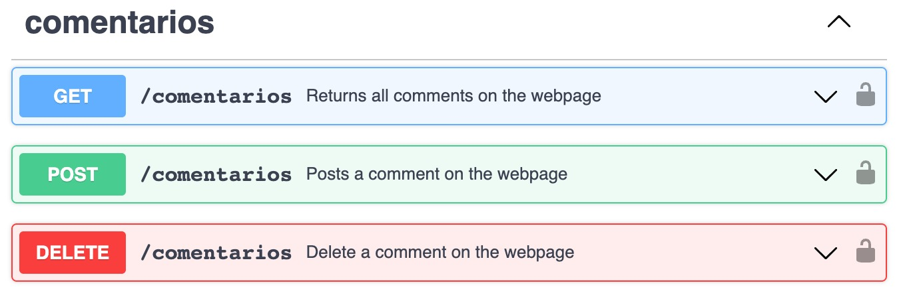
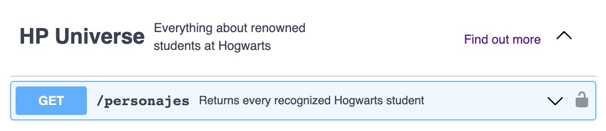
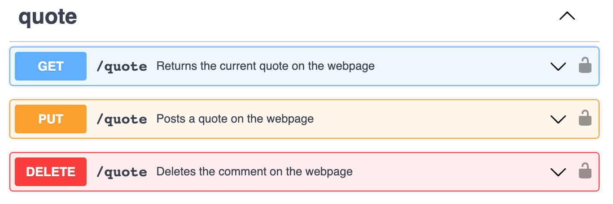

# tc2005b-minireto2

La aplicación es una página web que integra React para el front-end y NodeJS y Express para el back-end, junto con una base de datos en MySQL. Todo esto se despliega en Heroku para un hosting de full-stack desde la página web hasta la base de datos en MySQL, utilizando una adición a Heroku en forma de la base de datos ClearDB. La aplicación tiene una sola página en la que se muestran los diferentes personajes, englobados por cuadros para que se distingan entre sí. Debajo de los personajes se encuentra una sección de comentarios en la que un usuario puede publicar un comentario si así lo desea al ingresar texto en el cuadro de texto y darle clic en “Publicar comentario”. Para mostrar un comentario nuevo, es necesario refrescar la página.  Además, un comentario se puede borrar al darle clic en “Delete”. Sin embargo, igualmente se tiene que refrescar la página para poder visualizar los cambios. Después de una investigación un poco más a fondo, se encontró la manera de hacer que todo esto funcione esto sin refrescar la página, pero no se tuvo el tiempo suficiente para poder implementarlo para producción. Finalmente, la página tiene una funcionalidad para que los usuarios puedan subir su frase favorita del universo cinematográfico de Harry Potter y esta se muestra en la parte de abajo de la página. Esta frase se puede modificar para toda el sitio mediante la misma dinámica que la de los comentarios. Sin embargo, ahora al ingresar texto y dar clic en “Edit”, esta frase se puede editar si es que algún usuario encontrase una frase no grata o simplemente quiere desplegar otra frase célebre de su gusto.

